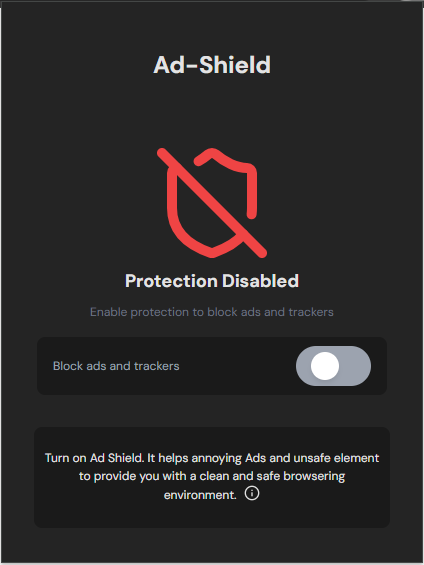
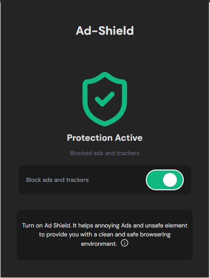

# AdShield

**Lightweight ad blocker that blocks intrusive ads, popups and malicious redirects for a smoother browsing experience**

> Transform your web browsing into a clean, safe, and distraction free experience

<!-- [Download Ad-Shield from Chrome Web Store](#) -->

**Latest Updates:**

- **Ad Detection**:
- **Malicious Redirect Protection**:
- **Lightweight Performance**:

## Why Did I Build This ?

Web browsing(Downloading animes) has become increasingly frustrating with intrusive ads, popups, and redirect attacks that compromise both user experience and security. After experiencing countless interruptions while browsing and seeing how existing solutions were either too heavy or missed critical threats, I decided to build a lightweight yet powerful solution.

AdShield was born from the need for a browser extension that i can build myself from scratch to:

- Blocks ads without slowing down your browser
- Protects against malicious redirects and pop-ups
- Maintains legitimate website functionality
- Provides users with control and transparency

The goal was simple: create a safe browsing environment while learning and leveraging the browser APIs and build a real life extension scenerio.

## Built With

- **WXT Framework** - Modern web extension framework
- **React** - User interface components
- **TypeScript** - Type safe development
- **Tailwind CSS** - Styling framework
- **Lucide React** - Icon library

### User Experience

- **Lightweight Design**: Fast loading with minimal resource usage
- **Real time Statistics**: See how many ads and trackers you've blocked
- **One click Toggle**: Easily enable/disable protection
- **Clean Interface**: Simple, intuitive user interface

### Screens

- Inactive blocker
  

- Activate blocker
  

<!-- ## 🔧 Installation

### From Chrome Web Store (Recommended)

1. Visit the Chrome Web Store
2. Search for "Ad-Shield" or use the direct link
3. Click "Add to Chrome"
4. Click the Ad-Shield icon in your toolbar to start protecting your browsing -->

<!-- ### Manual Installation (Development)

1. Download the latest release
2. Open Chrome Extensions page (`chrome://extensions/`)
3. Enable "Developer mode"
4. Click "Load unpacked" and select the extension folder
5. Ad-Shield is now ready to protect your browsing -->

### What Gets Blocked

- **Display Ads**
- **Popup Ads**:
- **Redirect Attacks**
- **Tracking Scripts**
- **Malicious Iframes**

## Development

Want to contribute or run Ad-Shield locally?

```bash
# Clone the repository
git clone https://github.com/Segundavid-Dev/AdShield

# Navigate to project directory
cd AdShield

# Install dependencies
pnpm install

# Start development server
pnpm run dev
```

### Project Structure

```
.
├── README.md
├── active-page.PNG
├── assets
├── components
├── components.json
├── context
│   ├── SwitchContext.tsx
│   └── SwitchProvider.tsx
├── core-components.md
├── entrypoints
│   ├── background.ts
│   ├── content.ts
│   └── popup
├── hooks
│   └── useSwitch.ts
├── inactive-page.PNG
├── lib
│   └── utils.ts
├── node_modules
├── package.json
├── pnpm-lock.yaml
├── public
│   ├── icon
│   └── wxt.svg
├── tsconfig.json
├── types.ts
└── wxt.config.ts
```

## Contributing

Contributions are welcome! Here's how you can help:

1. **Report Issues**: Found a bug or have a feature request? Open an issue
2. **Submit PRs**: Fork the repo, create a branch, and submit a pull request
3. **Test & Feedback**: Try the extension and share your experience

Thanks for reading! :)
